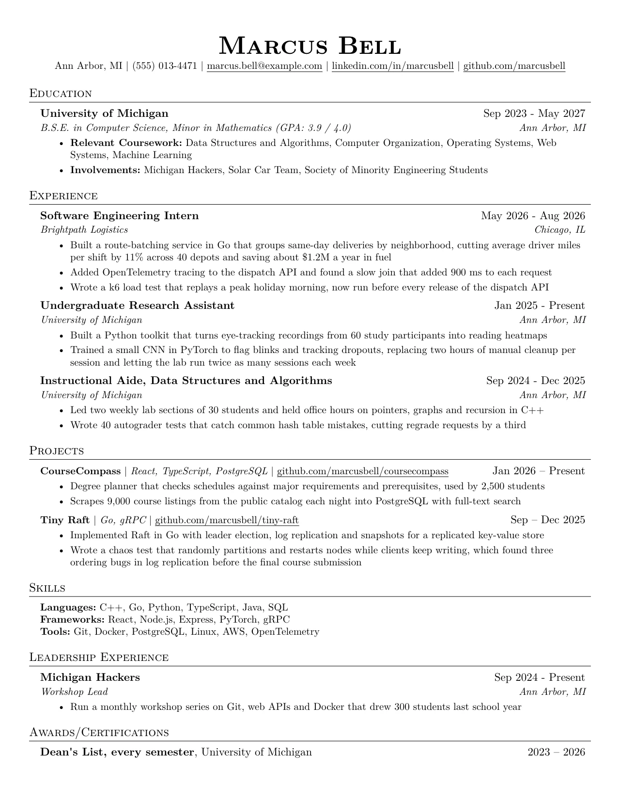
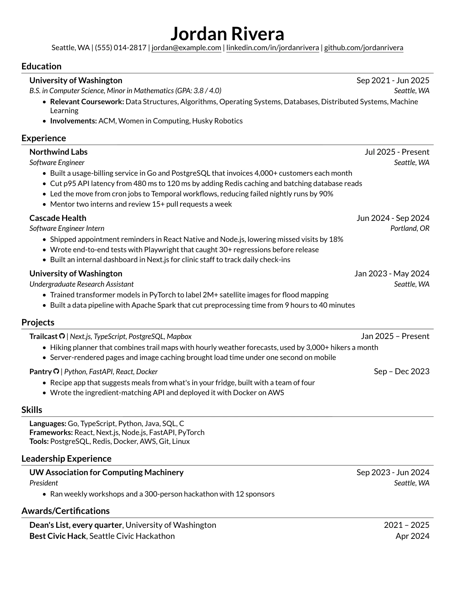
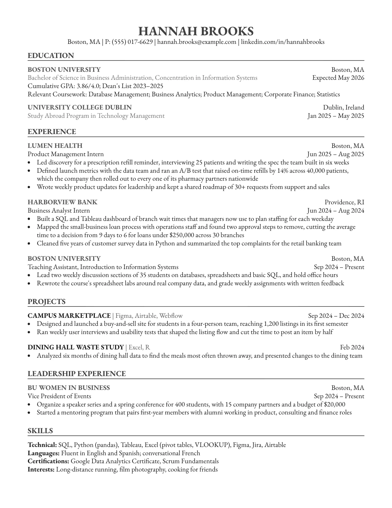

<p align="center">
  <a href="https://www.tryresumezip.com">
    
  </a>
</p>

<h1 align="center">resumezip</h1>

<p align="center">
  Your resume. Not our data.<br>
  A free, open-source resume builder that runs in your browser. Pick a template, write, and download the PDF.
</p>

<p align="center">
  <a href="https://www.tryresumezip.com"><strong>Start writing →</strong></a>
  &nbsp;·&nbsp;
  <a href="https://www.tryresumezip.com/templates">Templates</a>
  &nbsp;·&nbsp;
  <a href="https://github.com/ian-hoang/resumezip/issues/new/choose">Report a bug</a>
</p>

<p align="center">
  <a href="https://github.com/ian-hoang/resumezip/actions/workflows/ci.yml"></a>
  <a href="LICENSE"></a>
</p>

<p align="center">
  
</p>

## Why resumezip

- **No account.** Open it and start writing. It's free, with nothing to install.
- **Private.** Your resume is saved in your browser and the PDF is made on your device. We don't store it.
- **Live preview.** The PDF updates as you type.
- **Pick up where you left off.** Every PDF carries its resume, so you can open it again on any computer and keep editing.
- **Bring your old resume.** Open a PDF or Word (.docx) file, check what was found, and carry on from there.
- **Made for applications.** Clean templates without icons or graphics that trip up applicant tracking systems.

## Templates

<table>
  <tr>
    <td align="center"><br>Jake's</td>
    <td align="center"><br>Modern Jake's</td>
    <td align="center"><br>Harvard</td>
  </tr>
</table>

<p align="center"><a href="https://www.tryresumezip.com/templates">See them all →</a></p>

## How it works

resumezip is a [Next.js](https://nextjs.org) app with no server of its own.

- Resumes live in your browser's local storage. resumezip asks the browser to keep them rather than clear them to free up space, but Safari still deletes a site's data after seven days of Safari use without a visit. That's the cost of having no accounts and no server: in Safari, keep your downloaded PDF, since it opens again as an editable resume.
- PDFs are made with [Typst](https://typst.app), running in the browser as WebAssembly through [typst.ts](https://github.com/Myriad-Dreamin/typst.ts), in a Web Worker so typing stays smooth.
- The preview and opening PDFs use [pdf.js](https://mozilla.github.io/pdf.js/). Word files are read with [mammoth](https://github.com/mwilliamson/mammoth.js).
- Each downloaded PDF has a copy of its resume attached, which is how it opens again for editing.

## Run it yourself

```bash
cd frontend
npm install
npm run dev   # http://localhost:3000
```

It uses Node 24. [`frontend/README.md`](frontend/README.md) covers the tests, how the code fits together, and adding a template.

## Contributing

Found a bug or have an idea? [Open an issue](https://github.com/ian-hoang/resumezip/issues/new/choose). The bug form asks how bad it is, so it gets the right label. Pull requests are welcome: [CONTRIBUTING.md](CONTRIBUTING.md) covers the checks to run and the few rules every change follows. Please [report security problems privately](https://github.com/ian-hoang/resumezip/security/advisories/new).

## License

[MIT](LICENSE) © Ian Hoang. The fonts in `frontend/src/lib/typst/fonts` keep their own licenses, listed in [`frontend/src/lib/typst/README.md`](frontend/src/lib/typst/README.md#fonts).

If resumezip helped you, a ⭐ helps other people find it.
